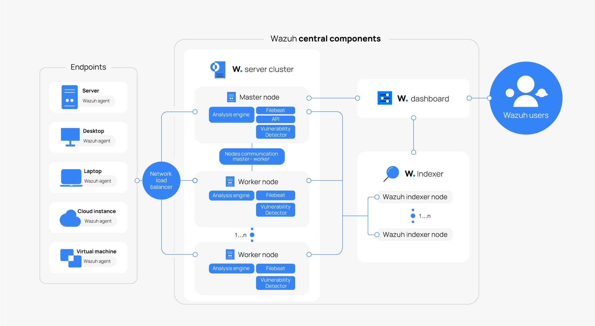

# Wazuh Installation Documentation

This guide provides step-by-step instructions to install and set up Wazuh locally. It also offers insights into its architecture and components for a comprehensive understanding.

---

## Table of Contents

1. [Understanding Wazuh](#understanding-wazuh)
   - [How It Works](#how-it-works)
   - [Architecture](#architecture)
2. [Installing Wazuh Locally](#installing-wazuh-locally)
   - [Bash Script Overview](#bash-script-overview)
   - [Installing All Components](#installing-all-components)
   - [Installing Individual Components](#installing-individual-components)
3. [Accessing the Dashboard](#accessing-the-dashboard)
4. [Support and Contribution](#support-and-contribution)

---

## Understanding Wazuh

Wazuh is a powerful open-source security platform that provides capabilities for **threat detection**, **compliance management**, and **incident response**. 

### How It Works

Wazuh operates on three primary components:

1. **Indexer**: Stores and indexes data for analysis and search purposes.
2. **Manager (or Server)**: Handles agent communications, log analysis, and event correlation.
3. **Dashboard**: Provides a user-friendly interface for monitoring and managing the platform.

---

### Architecture

Below is a visual representation of Wazuh’s deployment architecture:



The architecture showcases how different components interact to deliver a seamless security monitoring experience.

---

## Installing Wazuh Locally

To simplify the installation process, Wazuh provides a bash script that can be used to install, uninstall, or manage its components.

### Prerequisites

- **Non-root User**: Ensure you are running the script as a non-root user.
- **Private IP Address**: If running on a virtual machine, use the private IP address of the VM. Access the dashboard using the public IP.

---

### Bash Script Overview

The bash file (`wazuh-setup.sh`) allows you to configure and manage Wazuh components. Below are the key parameters:

- **`--distro`**: Specify your Linux distribution (`rpm` for RHEL-based or `deb` for Debian-based systems).
- **`--ip`**: Provide the private IP address of your machine.
- **`--action`**: Specify the action to perform (`install` or `uninstall`).
- **`--component`**: Choose the component to manage (`all`, `indexer`, `manager`, `filebeat`, or `dashboard`).

---

### Installing All Components

To install all components in one go, use the following command:
```bash
bash wazuh-setup.sh --distro rpm/deb --ip <your-private-ip> --action install --component all
```

---

### Installing Individual Components

You can also install components individually. Use the commands below for each:

#### Install Indexer
```bash
bash wazuh-setup.sh --distro rpm/deb --ip <your-private-ip> --action install --component indexer
```

#### Install Manager
```bash
bash wazuh-setup.sh --distro rpm/deb --ip <your-private-ip> --action install --component manager
```

#### Install Filebeat
```bash
bash wazuh-setup.sh --distro rpm/deb --ip <your-private-ip> --action install --component filebeat
```

#### Install Dashboard
```bash
bash wazuh-setup.sh --distro rpm/deb --ip <your-private-ip> --action install --component dashboard
```

---

## Accessing the Dashboard

Once the setup is complete, you can access the Wazuh Dashboard at:  
**[http://localhost](http://localhost)**

### Default Credentials:
- **Username**: `admin`
- **Password**: `admin`

---

## Support and Contribution

For any issues during installation or setup, feel free to:
- Raise an issue in the repository.
- Refer to the [official Wazuh documentation](https://documentation.wazuh.com/).
- Contact the maintainers for guidance.

If you wish to contribute, ensure that:
- Your code adheres to the existing standards.
- Proper testing is performed before submitting changes.

> **Happy Securing!** 🚀
